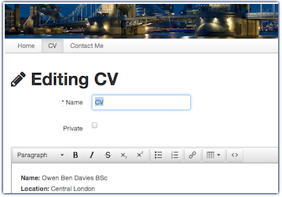

CMS
===

[](https://travis-ci.org/obduk/cms)
[](https://gemnasium.com/obduk/cms)
[](https://codeclimate.com/github/obduk/cms)
[](https://coveralls.io/r/obduk/cms)

A Content Management System (CMS) written with Ruby on Rails. Although it is a
working project, it was not created with the intention of being a production
system. Instead this has been my practice project over the years, used for
testing new ideas.

For an example, check out my personal website at http://www.obduk.com



Dependencies
------------

This project requires a system running the following software:

* Ruby
* Bundler
* PostgreSQL
* Imagemagick
* Mailcatcher (For development)

For more detailed dependencies, this is the project I use for setting up my
development and live servers: https://github.com/obduk/setup_server

Setup
-----

Run the following to setup the project.

```shell
./bin/bootstrap
```

Test
----

To run the tests run the following to make sure the system is set up correctly.

```shell
./bin/test
```

Or run one test file:

```shell
./bin/test spec/some_file.rb
```

Setup data
----------

Currently it is only possible to create sites and users via the command line.
To set up data run the following:

```shell
./bin/interactive
```

First create an account to use, replacing email, password and sites with
appropriate data.

```ruby
account = Account.new
account.email = 'test@example.com'
account.password = 'password'
account.password_confirmation = 'password'
account.save!
```

Next create the site, replacing host and name with appropriate data.

```ruby
site = Site.new
site.host = 'localhost'
site.name = 'Test Site'
site.created_by = account
site.updated_by = account
site.save!
```

Next add the site to the account.

```ruby
account.sites << site
```

Development
-----------

Run the following to spin up a server locally for development:

```shell
./bin/server
```

Deployment
----------

For deploying to a Linux server like Ubuntu.

### Setup

Setup the deploy servers in the capistrano file:

```
config/deploy/production.rb
```

### Services

Sign up to the following services

* Email service (e.g. [Amazon SES](http://aws.amazon.com/ses/) or [SendGrid](http://sendgrid.com/))
* [New Relic](http://newrelic.com/) for system monitoring
* [Sentry](https://www.getsentry.com/) for error tracking
* [loader.io](http://loader.io/) for load testing

Now add their settings to the configuration file:

```
config/deploy/production.secrets.yml
```

### Cloud Files

Rackspace cloud files is used to store and serve site images and stylesheets in
production. Follow these steps to set up:

* Signup up for a [Rackspace](http://www.rackspace.com/) account
* Update `rackspace_username` and `rackspace_api_key` in
  `config/deploy/production.secrets.yml`
* Create a container called `environment_cms_host_name` for each site created
  and make a note of it's url, e.g. for a site with the host www.example.com in
  development mode, create a container called `development_cms_www_example_com`
* When adding sites, set the `asset_host`, e.g.
  `site.asset_host = 'http://b80c6e.rackcdn.com'`

### Amazon CloudFront

It is recommended to set up a Amazon CloudFront distribution to serve the Rails
assets. Once set up, add the distribution url to `asset_host` in
`config/deploy/production.secrets.yml`.

### Setup data

Next to set up the data for users and sites run the following:

```shell
RAILS_ENV=production ./bin/interactive
```

Now follow the steps in [Setup data](#setup-data).

### Deploy

Use Capistrano to deploy to the servers:

```shell
./bin/cap production deploy
```

